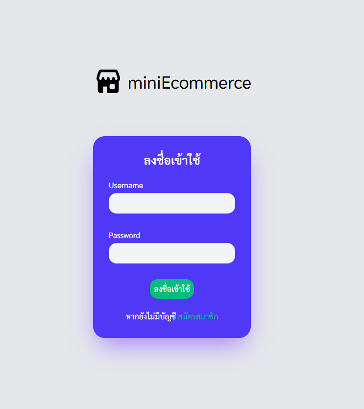
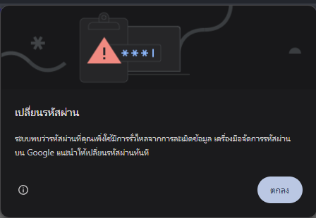
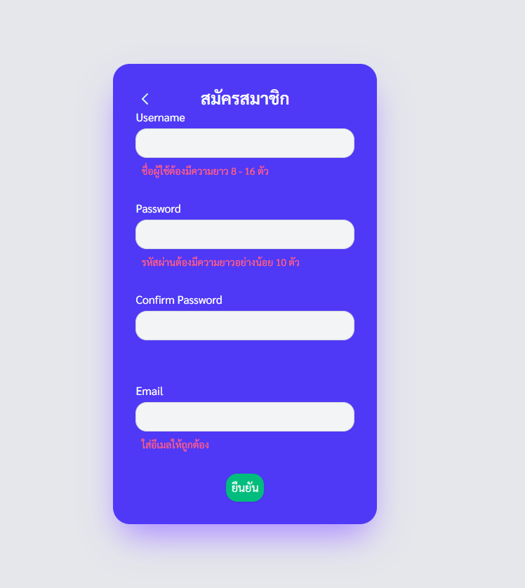
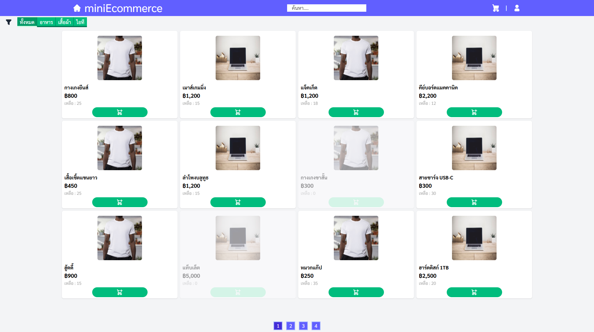
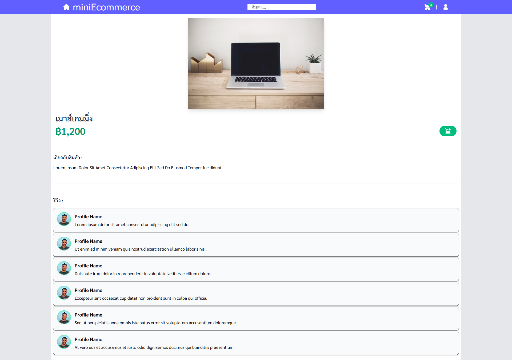
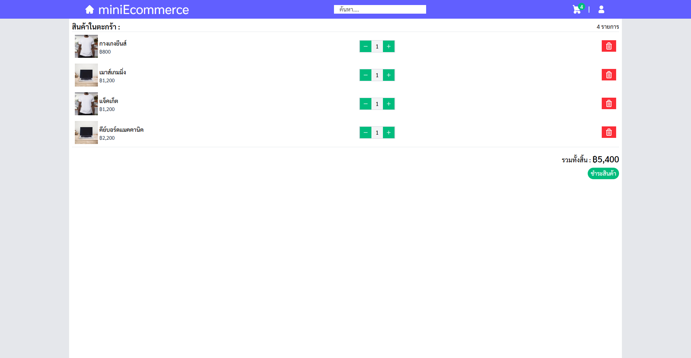
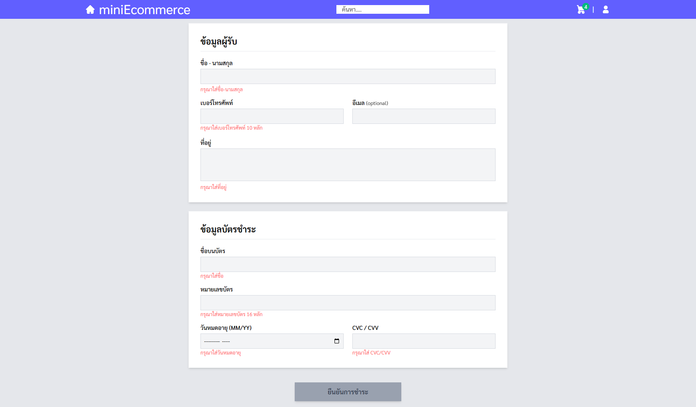

# ⚠ **สำคัญ**
- โปรเจคนี้จัดทำขึ้นเพื่อศึกษาและแสดงความสามารถของผู้จัดทำเท่านั้น
- ไม่จำเป็นต้องใช้ข้อมูลจริงในการใช้งานเว็บ

# 💻 **Techstack**
Frontend : Angular + Tailwind CSS  
Backend  : .Net Core Web API  
Database : PostgreSQL  

# 📚 **คู่มือการใช้งาน**
🔐 **หน้า ล็อกอิน**  
  

  

  
  หน้าแรกที่ผู้ใช้ทุกคนจะต้องลงชื่อเข้าใช้ หากยังไม่มีบัญชีสามารถสร้างได้ที่ด้านล่างกดที่คำว่า `สมัครสมาชิก`  
  
⚠ **ปัญหาที่อาจพบเจอ**

  

  
- หลัง login เสร็จหากใช้ chrome และตั้งรหัสผ่านแบบง่ายเช่น 1234567890 อาจมีแจ้งเตือนตามรูปซึ่งเป็นการแจ้งจากเตือนจาก Chrome แต่ยังใช้งานได้ตามปกติ

 
 
 

🖋 **หน้า สมัครสมาชิก**
  

  

  
  สำหรับสร้างบัญชีผู้ใช้ใหม่ผู้ใช้จำเป็นต้องกรอกข้อมูลให้ครบถ้วนตามเงื่อนไขดังนี้:

- Username: ความยาวระหว่าง 8–16 ตัวอักษร  
- Password: ต้องมีความยาวอย่างน้อย 10 ตัวอักษร  
- Confirm Password: ต้องตรงกับรหัสผ่านที่กรอกไว้  
- Email: ใช้สำหรับเป็นข้อมูลอ้างอิงในบัญชี

ระบบจะตรวจสอบความถูกต้องของข้อมูลก่อนทำการสร้างบัญชีใหม่ และแจ้งข้อผิดพลาดทันทีหากข้อมูลไม่ครบหรือไม่เป็นไปตามเงื่อนไข

 
 
 
  
🛍️ **หน้า รายการสินค้า**  

  

  
หน้าแรกที่หลังผู้ใช้ล็อกอินเสร็จมี 3 ส่วนหลักดังนี้:

- รายการสินค้า: เมื่อกดที่การ์ดสินค้าจะเปิดหน้ารายละเอียดสินค้า ปุ่มจะเป็นการเพิ่มสินค้าลงในตะกร้า
- ตัวกรอง(filter): กรองรายการสินค้าจะตามประเภทของสินค้าทั้ง 3 อย่างได้แก่ `อาหาร` `เสื้อผ้า` `ไอที` โดยค่าเริ่มต้นจะแสดง`ทั้งหมด`
- แบ่งหน้ารายการสินค้า: รายการสินค้าจะถูกแบ่งเป็นหน้า 2 คอลัมน์บนมือถือและ 4 คอลัมน์บนเดสท็อป และกำหนดรายการที่แสดงต่อหน้า 10 , 12 ชื้น ตามลำดับ

> หากกดปุ่มเพิ่มลงตะกร้าซ้ำจะเพิ่มจำนวนสินค้านั้นๆ 1 ชิ้น

 
 
 

🧾 **หน้า รายละเอียดสินค้า**  

  

 

แบ่งเป็น 3 ส่วนดังนี้  
 - ข้อมูลสินค้า: รูป ชื่อ ราคา และปุ่มเพิ่มสินค้าในตะกร้า  
 - เกี่ยวกับ: อธิบายสินค้าหรือละเอียดต่างๆของตัวสินค้า  
 - รีวิว: review mock up

 
 
 

🧭 **Navbar**  

  

- ปุ่ม 🏠 ใช้สำหรับกลับไปหน้าแรก(หน้ารายการสินค้า)
- ช่องค้นหารายการสินค้า(ยกเว้นสินค้าที่หมดแล้ว)
- ปุ่ม 🛒 เปิดไปหน้าตะกร้า
- ปุ่ม 👤 เปิดไปหน้าโปรไฟล์

 
 
 

🛒 **หน้า ตะกร้า**

  

แสดงรายการสินค้าทั้งหมดที่เพิ่มลงตะกร้า ผู้ใช้สามารถปรับเพิ่มลดจำนวนสินค้าในตะกร้าได้ทั้งหมด(ลดได้ไม่น้อยกว่า 1)หรือลบออกจากตะกร้า  
เมื่อผู้ใช้ต้องการชำระสินค้าทั้งหมดสามารถกดที่ปุ่ม `ชำระสินค้า` เพื่อไปยังหน้าชำระ

 
 
 

💳 **หน้า ชำระ**  

  

  
  
ภายในหน้าชำระนั้นจะเป็นหน้าสำหรับกรอกแบบฟอร์มทั้งหมดโดยจะมี 2 ส่วนหลัก:  
- ที่อยู่: ประกอบไปด้วย ชื่อผู้รับ เบอร์โทรศัพท์ อีเมล(ตัวเลือก) ที่อยู่  
- รูปแบบ: payment mock  

> หลังจากกดปุ่ม `ยืนยันชำระ` จะกลับไปหน้าแรก

 
 
 

👤 **หน้า โปรไฟล์**  

  

- แสดงข้อมูลของบัญชี username email และปุ่ม `logout`  
- ประวัติรายการสั่งซื้อแบบ collapse

 
 
 
